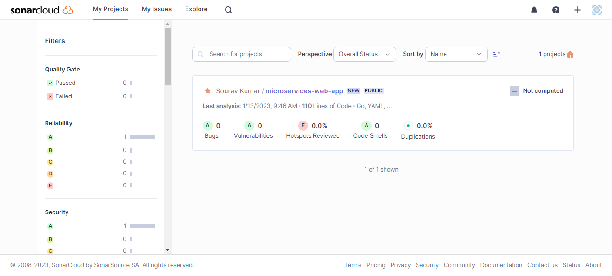

# SAST Implementation with SonarCloud

SonarCloud is a cloud-based platform that provides static code analysis to help developers find and fix code quality issues in their projects. It is designed to work with a variety of programming languages and tools, including Java, C#, JavaScript, Golang, and more.

SonarCloud offers a range of features to help developers improve the quality of their code, including:

- **Static code analysis**: SonarCloud analyzes the source code of a project and checks for issues such as coding style violations, potential bugs, security vulnerabilities, and other problems. It provides developers with a detailed report of the issues it finds, along with suggestions for how to fix them.
- **Code review**: SonarCloud integrates with code review tools like GitHub pull requests, allowing developers to receive feedback on their code from their peers before it is merged into the main branch. This helps to catch issues early on in the development process, reducing the risk of bugs and other issues making it into production.
- **Continuous integration**: SonarCloud can be integrated into a continuous integration (CI) pipeline, allowing it to automatically run static code analysis on every code commit. This helps developers catch issues early and fix them quickly, improving the overall quality of their codebase.
- **Collaboration**: SonarCloud includes tools for team collaboration, such as the ability to assign issues to specific team members and track the progress of code review and issue resolution.
- **Customization**: SonarCloud allows developers to customize the rules and configurations used for static code analysis, so they can tailor the analysis to fit the specific needs and coding standards of their team.

Overall, SonarCloud is a valuable tool for developers looking to improve the quality of their code and reduce the risk of issues making it into production. It helps teams collaborate and catch problems early on in the development process, leading to faster, more efficient development and fewer bugs in the final product.

Read more about SonarCloud [here](https://docs.sonarcloud.io/)

## Integrate SonarCloud with GitHub Actions

### Step:- 1
 Sign up for a [SonarCloud](https://sonarcloud.io/) account with your GitHub Account.

### Step:- 2
From the dashboard, click on “Import an organization from GitHub”

### Step:- 3
Authorise and install SonarCloud app to access your GitHub account.
Then Select the repository (free tier supports only public repositories) you want to analyze and click "Install"

    
### Step:- 4
In SonarCloud you can now create an organisation.

Then Select the Plane

### Step:- 5
Click on setup to add the Project.

Click On SetUp Button

Now on the SonarCloud dashboard you can the project.

### Step:- 6
 To setup the GitHub Actions, Go on **Information** > **Last analysis method**

Then go to the Last analysis

Click on **GitHub Actions**

This will show some steps to integrate SonarCloud with GitHub actions. At the top you will see SONAR_TOKEN, we will add that as Github Secrets later.

### Step:- 7
Now You can see the Secret that we will use to set up the Github Action. So let Setup this Secret to your Github Secret.

> Don't Close this Page Becaouse we will be going back and forth to this page so open anything into a new tab.

Now to Your Github Repo and open that project which you have seleted will create SonarCloud Account.

Now go **Settings** Then left side click on **Secrets and analysis** -> Then Select **Action**

Now Click on **New Repository secret** and fillup the Token **Name**  as we show on the SonarCloud page and fillup the Secrets what we got from SonarCloud

Then Click on **Add Secret** and Now you have added you Secret to your github action.

### Step:- 8

Now we will Create configuration file that we will have to add in the source code repo or the same place where you readme file is there.

To get the Configuration Content just **Select Programming Language** that you Project is based on.

Now you can create a file by just using the Github UI or You can use the Github Codespaces. I'm Using the Github Codespaces.

I have already create Github Codespaces Now let's Create the file.
>Note that the file Name should be same as shown on the SonarCloud Page `sonar-project.properties`.

Then copy the file content from the SonarCloud Page and paste it to the file that we just Created.

Now make the file commit.

So Now we have Setup the config File

### Step:- 9
Now It's time to Create the Github Action. The file Content for the github action will be also is on the SonarCloud.

This is the yaml file that we will paste it on the github action page to create an action. Your Yaml will be different then mine it wil be as per you programming language.

Let go to gihtub page and Click On the **Action** 

Now Click on the **Set up a Workflow Yourself** 

Now Paste the Code that you have Copied from the SonarCloud page and change the name to build you can use the main name also.

Now Let's Commit this action file.

And if you have do Every thing right then you action will work Fine.

At the bottom of page of , disable the Automatic Analysis

### Step:- 10

Now after every commit, you can check the updated reports on the SonarCloud dashboard.

